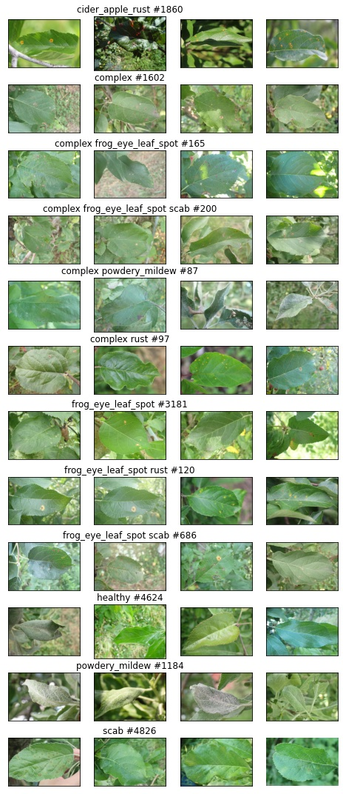
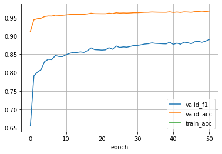

# Kaggle: [Plant Pathology 2021 - FGVC8](https://www.kaggle.com/c/plant-pathology-2021-fgvc8)


Foliar (leaf) diseases pose a major threat to the overall productivity and quality of apple orchards.
The current process for disease diagnosis in apple orchards is based on manual scouting by humans, which is time-consuming and expensive.

The main objective of the competition is to develop machine learning-based models to accurately classify a given leaf image from the test dataset to a particular disease category, and to identify an individual disease from multiple disease symptoms on a single leaf image.



## Experimentation

### install this tooling

A simple way how to use this basic functions:
```bash
! pip install https://github.com/Borda/kaggle_plant-pathology/archive/main.zip
```

### run notebooks in Colab

* [Plant pathology with Lightning](https://colab.research.google.com/github/Borda/kaggle_plant-pathology/blob/main/notebooks/Plant-Pathology-with-Lightning.ipynb)
* [Plant pathology with Flash](https://colab.research.google.com/github/Borda/kaggle_plant-pathology/blob/main/notebooks/Plant-Pathology-with-Flash.ipynb)

I would recommend uploading the dataset to you personal gDrive and then in notebooks connect the gDrive which saves you lost of time with re-uploading dataset when ever your Colab is reset... :]

### some results

Training progress with ResNet50 with training  for 10 epochs:


